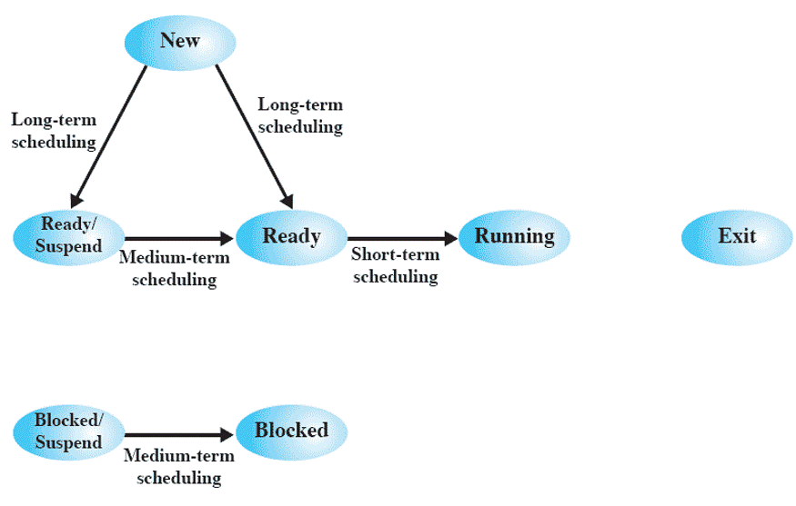
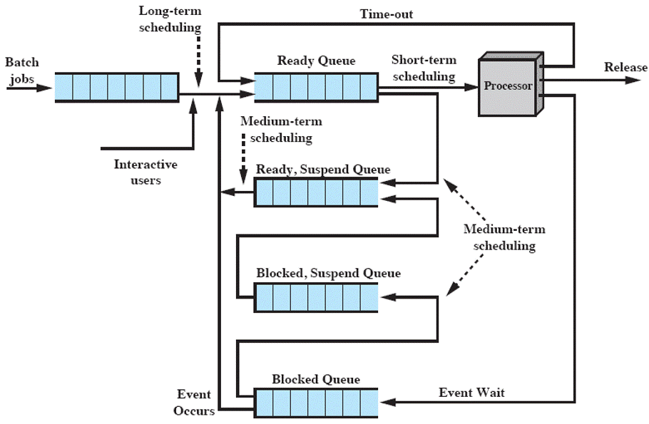
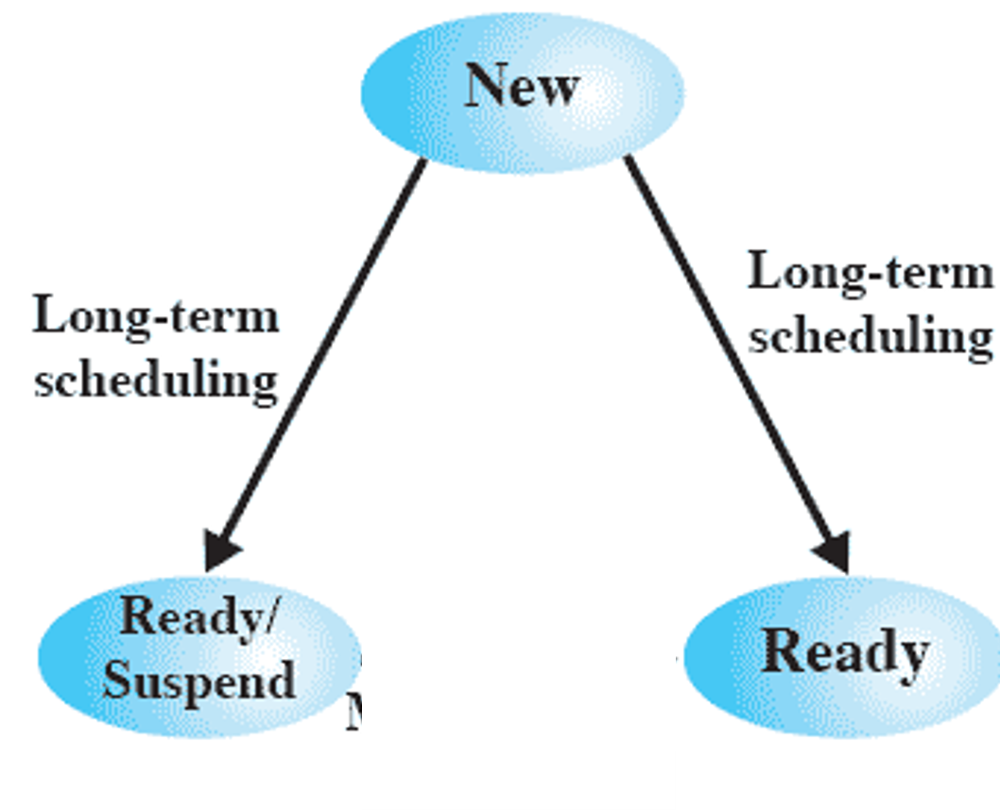
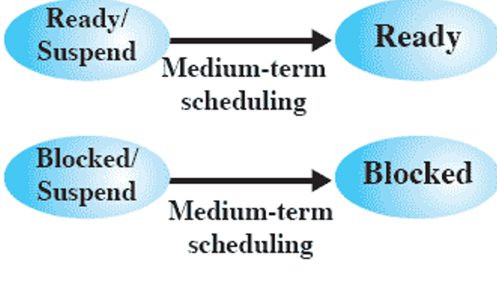
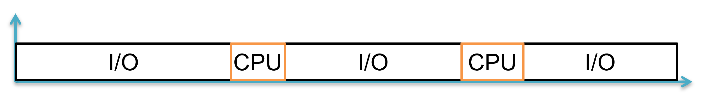
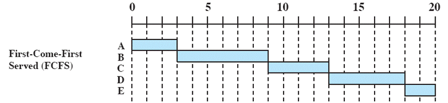
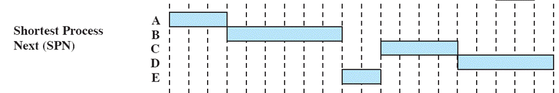
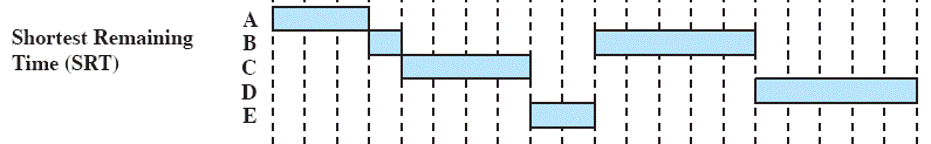
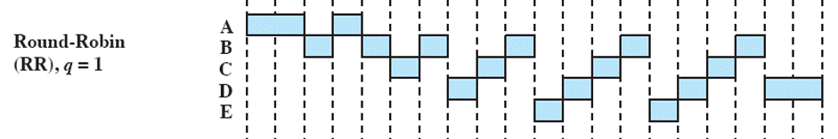

<h1 style="text-align:center;color:cyan;">    Uniprocessor Scheduling</h1>

# Scheduling Objectives

1. Share time **fairly** among processes
2. Prevent **starvation** of a process
3. Use the **processor efficiently**
4. Have **low overhead**
5. **Prioritise** processes when necessary (e.g. real time deadlines)

# Types of Scheduling

|Name                                       |Type|
|-------------------------------------------|--------------------------------------------------------------------------------|
|**Long-term scheduling**         	                        |whether to add a new process to the set of processes that are currently active|
|**Medium-term scheduling**	                        |whether to add a process to those that are at partially (or fully) in main memory |
|**Short-term scheduling**                      |actual decision of which ready process to execute next on CPU
 | **I/O scheduling**	                      |Which I/O pending processes shall be handled by the available I/O device                                            |

   

## Types of Scheduling [States]

                          

## Types of Scheduling [Queues]                  

  

# [1] Long-Term: 

- Determines which programs are admitted to the system for processing, according to:

> first-come-first-served

> priority

>I/O requirements 

>expected execution time

- Executes **infrequently**

-  Controls  **the degree of  multiprogramming**

- More processes **❱❱** smaller amount of time each process is executed

  

  

# [2] Medium-Term: 

Part of the swapping function

decision based on the need to  manage  **the degree of  multiprogramming**

Executes **most frequently** 

  

  

# [3] Short-Term: 

Known as dispatcher

Executes **most frequently** 

Invoked when an event occurs

> Clock interrupts

> I/O interrupts

>Operating system calls

>Signals

  

  

# Performance Criteria

|  **User-oriented**   |  **System-oriented**    | 
|---------------------|------------------------|
| behavior of system as perceived by user/        process      Ex: Response Time    " elapsed time between the submission of a request until the response begins to appear as output"| focus on effective and **efficient utilization** of **CPU**   Ex: Throughput    "number of processes completed per unit of time"|

 

|  **performance related**   |  **Non-performance related**      | 
|---------------------|------------------------|
|Quantitative  Easily measured   Ex: response time and throughput| Qualitative   Hard to measure   Ex: predictability|

 

|   |   **performance related**     | **Non-performance related** | 
|---------------------|------------------------|------------------------|
| **User-Oriented**  | Turnaround time  Response time Deadlines  |Predictability|
| **System-Oriented** |Throughput  CPU Utilization|Fairness  Enforce Priorities Balancing Resources  |

 

|Name                                       |Defination|
|-------------------------------------------|--------------------------------------------------------------------------------|
|**Turnaround time**         	                        |this is the interval of time between the submission of a process and its completion. Includes actual execution time plus time spent waiting for resources, including the processor. this is an appropriate measue for a batch job.|
|**Medium-term scheduling**	                        |whether to add a process to those that are at partially (or fully) in main memory |
|**Short-term scheduling**                      |actual decision of which ready process to execute next on CPU
 | **I/O scheduling**	                      |Which I/O pending processes shall be handled by the available I/O device                                            |

   

# Types of Processes

|  **Processor-Bound**   |  **I/O-Bound**      | 
|---------------------|------------------------|
|It mainly performs computational work and occasionally uses I/O devices.    |depends primarily on the time spent waiting for I/O operations.    |

 

----------------------------------------------------------------------------------------------------
# Short-Term Policies

|  **Non-preemptive**   |  **Preemptive**      | 
|---------------------|------------------------|
|process in run state will continue until it terminates or blocks itself for I/O|running process may be interrupted and moved to ready state by the OS   Preemption may occur when :   ❱ new process arrives   ❱ on an interrupt   ❱ or periodically [clock interrupt]|

  

## Example: 

- consider each process a batch job

- Service time represents total execution time

- **Time now = 0**

### Calculate
1. Finish time
2. Turnaround time & its average
3. Normalized turnaround time & its average
4. Wait time & its average

 

   |Process    | Arrival Time  |Service Time   |
   |-----------|---------------|---------------|
   |    A      |       0       |      3        |
   |    B      |       2       |      6        |
   |    C      |       4       |      4        |
   |    D      |       6       |      5        |
   |    E      |       8       |      2        |

 

| Rules    Turnaround time = finish – arrival = service + wait   -----------------------------------------------------------   Normalized turnaround = (finish – arrival) / service  -----------------------------------------------------------  Wait time = turnaround – service  -----------------------------------------------------------  CPU Utilization = Time of CPU / Total Time x 100  |
|-----------|

 

--------------------------------------------------------

FCFS
 
> First Come First Serve
- Each process joins the Ready queue
- Select process with max wait-time
- Non-preemptive

 

 |Process|A | B |C|D|E|Average|
 |-------|--|---|----|-----|--|-----|
 |Finish Time|3|9|13|18|20|
 |Turnaround Time|3|7|9|12|12|8.60 |
 |Normalized turnaround|1.00|1.17|2.25|2.40|6.00|  2.56|         |
   |    Wait Time      | 0|1|5|7|10            |            |
   

 

<table>			   
				   	  
<table>
	 <tr>
		 <td> 
          Props
         </td>
		 <td> 
         Concs 
         </td>
	</tr>
    <tr>
		 <td> 
          Simplest  min overhead  No starvation 
        </td>
		 <td> Bad response time for short process (may have to wait a very long time before it can execute)
  Favors CPU-bound processes --> inefficient use of I/O  (I/O-bound has to wait until all CPU-bound processes complete)
        </td>
 </table>
      

--------------------------------------------
SPN
 
> Shortest Process Next 
- Short process jumps ahead of longer processes

- Select process with shortest expected time

- Non-preemptive

 

 
 

 |Process|A | B |C|D|E|Average|
 |-------|--|---|----|-----|--|-----|
 |Finish Time|3|9|15|20|11|
 |Turnaround Time|3|7|11|14|3|7.60 |
 |Normalized turnaround|1.00|1.17|2.25|2.80|1.50|1.84|         |
   |    Wait Time      | 0|1|7|9|1            |            |
   

 

<table>			   
				   	  
<table>
	 <tr>
		 <td> 
          Props
         </td>
		 <td> 
         Concs 
         </td>
	</tr>
    <tr>
		 <td> 
          High throughput  Good response time for short processes 
        </td>
		 <td> Overhead (to estimate service time)
  Starvation for long processes  Bad predictability of longer processes  inefficient use of I/O devices (I/O bounds need to wait current running CPU-bound)
        </td>
 </table>
                 

-------------------------------------------------------
SRT
 
>Shortest Remaining Time  
- Preemptive version of SPN

- Preemption on process arrival 

- Select process with min (service – execution)

 

 
 

 |Process|A | B |C|D|E|Average|
 |-------|--|---|----|-----|--|-----|
 |Finish Time|3|15|8|20|10|
 |Turnaround Time|3|13|4|14|2|7.20 |
 |Normalized turnaround|1.00|2.17|1.00|2.80|1.00|1.59|         |
   |    Wait Time      | 0|7|0|9|0            |            |
   

 

<table>			   
				   	  
<table>
	 <tr>
		 <td> 
          Props
         </td>
		 <td> 
         Concs 
         </td>
	</tr>
    <tr>
		 <td> 
          High throughput  Good response time for short processes  Efficient use of I/O devices (prefer I/O-bounds over CPU-bounds) 
        </td>
		 <td> Overhead (to estimate service time)
  Starvation for long processes  Bad predictability of longer processes        </td>
 </table>
                 

---------------------------------------------------------

RR
 
>Round Robin  

- Preemptive version of FCFS

- Clock interrupt is generated at periodic intervals 
 
- each process is given a slice of time (quantum) before being preempted

- No need to know remaining time of the process

 

 
 

 |Process|A | B |C|D|E|Average|
 |-------|--|---|----|-----|--|-----|
 |Finish Time|4|18|17|20|15|
 |Turnaround Time|4|16|13|14|7|10.80 |
 |Normalized turnaround|1.33|2.67|3.25|2.80|3.50|2.71|         |
   |    Wait Time      | 1|10|9|9|5            |            |
   

 

<table>			   
				   	  
<table>
	 <tr>
		 <td> 
          Props
         </td>
		 <td> 
         Concs 
         </td>
	</tr>
    <tr>
		 <td> 
          Independent on service time  Good response time for short processes
        </td>
		 <td>   Favors CPU-bound processes --> inefficient use of I/O devices  (I/O bounds need to wait all CPU-bounds in the queue)
  Context-switch overhead    Affect the cache usage
     </td>
 </table>

 

  Solution    of   I/O Bound Problem  

## Virtual Round Robin

>  Produce fair treatment for I/O-bound
  

>  Use auxiliary queue with high priority over ready Q
   

>  Process from auxiliary Q allowed for a single quantum only
  

 

-------------------------------------------------------